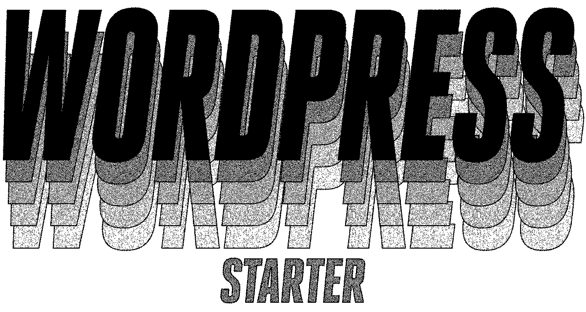

<p align="center">
  
</p>
<p align="center">
  <strong>WordPress starter</strong> is a starter template for WordPress websites.
  <br>
  <b>Stack:</b>
  <b><a href="https://babeljs.io">Babel</a></b>,
  <b><a href="https://www.browsersync.io">Browsersync</a></b>,
  <b><a href="https://gulpjs.com">Gulp</a></b>,
  <b><a href="https://jgthms.com/minireset.css/">minireset.css</a></b>,
  <b><a href="https://sass-lang.com">Sass</a></b>,
  <br>
  <b><a href="https://www.upstatement.com/timber">Timber</a></b>,
  <b><a href="https://webpack.js.org">Webpack</a></b>,
  <b><a href="https://wordpress.org">WordPress</a></b>,
  <b><a href="https://wp-cli.org">WP-CLI</a></b>.
</p>

- - -

## 📝 Table of contents
- [**Prerequisites**](#prerequisites)
- [**Getting started**](#getting-started)
- [**Commands**](#commands)
- [**Project structure**](#project-structure)
- [**Layout structure**](#layout-structure)
- [**Linting PHP files**](#linting-php-files)
- [**Cache busting**](#cache-busting)
- [**Authors**](#authors)
- [**Contributing**](#contributing)
- [**License**](#license)

- - -

<a name="prerequisites"></a>
## ⚙️ Prerequisites
- [**asdf**](https://github.com/asdf-vm/asdf)
- [**Composer**](https://getcomposer.org)
- [**Docker**](https://www.docker.com)
- [**Docker Compose**](https://docs.docker.com/compose)
- [**Make**](https://www.gnu.org/software/make/)
- [**Node.js**](https://nodejs.org)
- [**Yarn**](https://yarnpkg.com)

<a name="getting-started"></a>
## 🏁 Getting started
**Step 1:** Run the following command to create a new theme:

```
make create-theme
```

The prompt will ask you to enter some informations related to your theme, then to choose the site language. The starter theme is currently available in two languages:
- `en_US` (selected by default)
- `fr_FR`

If the desired language is not in the list, feel free to [contribute to the project](#contributing) by adding a [language](app/wp-content/themes/md-starter/languages).

**Step 2:** Run the following command to complete the installation:

```
make setup
```

**Your WordPress is ready to be themed!**

<a name="commands"></a>
## ⌨️ Commands
### Create theme
```makefile
## Run an interactive prompt to create a new theme

make create-theme
```

### Setup
```makefile
## Get everything ready (Docker containers, WordPress download
## and configuration)

make setup
```

### Serve
```makefile
## Serve:
## - WordPress front-office at http://localhost:3000 with live reloading
## - WordPress back-office at http://localhost:3010/wp-admin
##   (username: admin, password: password)
## - phpMyAdmin at http://localhost:3011

make
```

💡 This command will also **install dependencies** on first run and when `package.json` or `yarn.lock` files are updated.

### Build
```makefile
## Build WordPress theme for production use

make build
```

💡 This command will also **install dependencies** on first run and when `package.json` or `yarn.lock` files are updated.

### Help
```makefile
## List available commands

make help
```

<a name="project-structure"></a>
## 🗄️ Project structure
```
.
├── app                              # WORDPRESS SITE
│   ├── wp-content/themes/md-starter # WordPress theme to customize
│   │   ├── fonts                    # Font assets
│   │   │   └── roboto               # Roboto from Google Fonts (TTF, WOFF, WOFF2)
│   │   │
│   │   ├── images                   # Image assets
│   │   │   └── og-image.jpg         # Image for og:image meta tag (placeholder by default)
│   │   │
│   │   ├── languages                # Localization
│   │   │   ├── en_US.mo             # en_US theme localization (compiled)
│   │   │   ├── en_US.po             # en_US theme localization
│   │   │   ├── fr_FR.mo             # fr_FR theme localization (compiled)
│   │   │   ├── fr_FR.po             # fr_FR theme localization
│   │   │   └── md-starter.pot       # Theme localization template
│   │   │
│   │   ├── lib                      # Theme features
│   │   │   ├── disable_wp_emoji.php # Disabling WordPress emoji
│   │   │   └── theme.php            # Theme declaration and initialization
│   │   │
│   │   ├── post-types               # Post types
│   │   │   └── .gitkeep             # Tracking an empty directory within Git
│   │   │
│   │   ├── templates                # Twig templates
│   │   │   ├── components           # Components
│   │   │   │   ├── nav-footer.twig  # Footer nav
│   │   │   │   └── navbar.twig      # Main navbar
│   │   │   │
│   │   │   ├── dev                  # Development utilities
│   │   │   │   └── lorem.twig       # Partial featuring static lorem ipsum content
│   │   │   │
│   │   │   ├── layouts              # Layouts
│   │   │   │   └── default.twig     # Default layout
│   │   │   │
│   │   │   ├── 404.twig             # 404 error
│   │   │   ├── index.twig           # Home page
│   │   │   ├── page.twig            # Page
│   │   │   └── single.twig          # Single post
│   │   │
│   │   ├── 404.php                  # 404 error declaration
│   │   ├── composer.json            # PHP dependencies, used by Composer
│   │   ├── composer.lock            # Tracking exact versions for PHP dependencies, used by Composer
│   │   ├── functions.php            # Changing WordPress default behavior
│   │   ├── index.php                # Home page declaration
│   │   ├── page.php                 # Page declaration
│   │   ├── screenshot.png           # Theme screenshot, used in WordPress back-office
│   │   ├── single.php               # Single post declaration
│   │   └── style.css                # Theme CSS declaration
│   │
│   └── wp-cli.yml                   # WP-CLI configuration
│
│
├── bin                              # BINARIES
│    ├── create-theme                # Script to create a new theme
│    └── dwp                         # Script to use WP-CLI inside a Docker container
│
│
├── documentation-images             # PROJECT DOCUMENTATION IMAGES
│
│
├── gulp                             # GULP/WEBPACK CONFIGURATION AND TASKS
│   ├── env                          # Gulp configuration per environment
│   │   ├── dev.js                   # Development environment
│   │   └── prod.js                  # Production environment
│   │
│   ├── tasks                        # Gulp tasks
│   │   ├── sass.js                  # Sass task declaration
│   │   └── script.js                # JavaScript task declaration
│   │
│   ├── webpack                      # Webpack configuration per environment
│   │   ├── common.js                # Shared between development and production environments
│   │   ├── dev.js                   # Development environment
│   │   └── prod.js                  # Production environment
│   │
│   └── index.js                     # Script to invoke proper environment and dynamically load
│                                    # Gulp tasks
│
│
├── js                               # JAVASCRIPT SOURCE FILES
│   └── app.js                       # Main JavaScript file used as entry by Webpack
│
│
├── sass                             # SASS STYLE
│   ├── base                         # Base style
│   │   ├── _all.sass                # Importing all stylesheets
│   │   ├── generic.sass             # Style for generic elements (html, body, etc.)
│   │   └── helpers.sass             # Helper classes (modifiers)
│   │
│   ├── components                   # Components style
│   │   └── _all.sass                # Importing all stylesheets
│   │
│   ├── dev                          # Development utilities
│   │   ├── shame.sass               # WIP style or dirty hacks
│   │   └── structure.sass           # Highlighting site structure (import commented by default)
│   │
│   ├── elements                     # Elements style
│   │   ├── _all.sass                # Importing all stylesheets
│   │   └── title.sass               # Title style
│   │
│   ├── fonts                        # Fonts style
│   │   ├── _all.sass                # Importing all stylesheets
│   │   └── roboto.sass              # @font-face style for Roboto
│   │
│   ├── form                         # Form style
│   │   └── _all.sass                # Importing all stylesheets
│   │
│   ├── grid                         # Grid style
│   │   ├── _all.sass                # Importing all stylesheets
│   │   └── columns.sass             # Basic columns system
│   │
│   ├── layout                       # Layout style
│   │   ├── _all.sass                # Importing all stylesheets
│   │   ├── footer.sass              # Footer style
│   │   ├── header.sass              # Header style
│   │   ├── main.sass                # Main style
│   │   ├── section.sass             # Section style
│   │   └── wrapper.sass             # Wrapper style
│   │
│   ├── utilities                    # Utilities
│   │   ├── _all.sass                # Importing all stylesheets
│   │   ├── animations.sass          # Some basic animations
│   │   ├── mixins.sass              # A few useful mixins
│   │   └── variables.sass           # Variables for colors, typography, etc.
│   │
│   └── style.sass                   # Main Sass file used as source by Gulp
│
│
├── .babelrc                         # Presets and plugins to use, used by Babel
├── .gitignore                       # Files and folders ignored by Git
├── .tool-versions                   # Which version to use locally for each language, used by asdf
├── docker-compose.yml               # Services, networks and volumes, used by Docker Compose
├── Dockerfile                       # Docker containers declaration
├── gulpfile.js                      # Gulp configuration
├── LICENSE                          # License
├── Makefile                         # Commands for this project
├── package.json                     # JavaScript dependencies, used by Yarn
├── README.md                        # Project documentation
├── renovate.json                    # Renovate bot configuration
└── yarn.lock                        # Tracking exact versions for JavaScript dependencies,
                                     # used by Yarn
```

<a name="layout-structure"></a>
## 🖥 Layout structure
The starter comes with a simple layout, structured like the following:
```pug
// Wrapper
.wrapper
  // Header
  header.header
    .container
      …

  // Main
  main.main
    // Section (repeatable)
    section.section
      .container
        …

  // Footer
  footer.footer
    .container
      …
```

### Highlighting site structure
There is also a **Sass utility allowing to highlight the site structure** (pretty useful in development). Simply uncomment [`@import "dev/structure.sass"` in `style.sass`](sass/style.sass#L40) if you want to use it.

<a name="linting-php-files"></a>
## 🚨 Linting PHP files
Follow these steps if you want to lint PHP files using [WordPress Coding Standards](https://github.com/WordPress-Coding-Standards/WordPress-Coding-Standards).

**Step 1:** Install `wp-coding-standards/wpcs`:

```
make install-wpcs
```

**Step 2:** Move to your theme folder.

**Step 3:** Set path for `wpcs`:

```
composer config-set
```

**Step 4:** You are now able to lint any PHP file:

```
composer lint [filename].php
```

<a name="cache-busting"></a>
## 🍱 Cache busting
Our strategy for cache busting is to automatically append a `?ver=[version]` to each asset query. When you need to bust the cache, simply update [`Version` in `style.css`](app/wp-content/themes/md-starter/style.css#L5).

<a name="authors"></a>
## ✍️ Authors
- [**@Awea**](https://github.com/Awea) - Idea and initial work
- [**@mmaayylliiss**](https://github.com/mmaayylliiss) - Design, code/documentation review

<a name="contributing"></a>
## 🤜🤛 Contributing
**Contributions, issues and feature requests are welcome!** See the list of [contributors](../../graphs/contributors) who participated in this project.

<a name="license"></a>
## 📄 License
**WordPress starter** is licensed under the [GNU General Public License v3.0](LICENSE).
